# Pensamiento Lógico

## Habilidades básicas del pensamiento

Procesos que permiten obtener información del [objeto de observación](#objeto-de-observación) y concluir al respecto.

### Principales habilidades del pensamiento

- Observación
- Descripción
- Comparación
- Relación
- Clasificación

### Observación

Dentro de la habilidad del pensamiento nuestra observación se conforma a partir de la percepción. Existen dos tipos de observaciones.

- Concreta: Es aquella que nosotros tomamos al instante, cuando estamos frente al objeto o hecho.
- Abstracta: Basada en experiencias previas, cuando recibimos información la relacionamos con puntos de vistas o lo que ya conocemos de ese objeto.

¿Cómo observamos?

- Percibimos
- Recopilamos
- Registramos
- Identificamos

Cuando nosotros observamos tomamos las variables de un objeto.

En la siguiente [imagen](#img1) tenemos diferentes tipos de cabello, las variables del cabello podrían ser el color, el largo, entre otros. Podrías utilizar tus sentidos para recopilar más información como el olor o la textura.

El tipo de observación viene dado por el tipo de suceso u objeto.

<figure>
    
    <figcaption>Img 1 - Cabello</figcaption>
</figure>

### Descripción

Se refiere a describir lo que ya observamos y se obtiene a partir de las siguientes preguntas:

- ¿Qué es?
- ¿Qué tiene?
- ¿Cómo es?
- ¿Qué función cumple?
- ¿Qué pasó?

¿Cómo describiríamos un pastel? ¿Cuáles son sus variables?

- Sabor
- Color
- Tamaño

Todas estas variables podemos responderlas o identificarlas a partir de las preguntas anteriores:

- ¿Qué es?: Un pastel
- ¿Qué tiene?: El cómo está conformado el pastel, glaseado, merengue, etc.
- ¿Cómo es?: Físicamente, ¿cómo lo percibimos? Rosa, azul, grande, pequeño, etc.
- ¿Qué función cumple?: Dar un momento placentero al gusto.
- ¿Qué pasó?:N/A

En base a las respuestas podemos entablar un enunciado para describir el pastel, ejemplo:

Es un pastel grande que sabe a vainilla, tiene una forma circular y es para mi cumpleaños.

Así es como nosotros captamos esta variables, les damos valores a partir del objeto que estamos estudiando y podemos hacer su descripción.

### Comparación

Observa la siguiente [imagen](#img2) durante unos segundos.

<figure>
    
    <figcaption>Img 2 - Astronautas</figcaption>
</figure>

La comparación se da a partir de la observación, ambas imágenes (derecha e izquierda) tienen ciertas diferencias:

- El cohete de la bandera tiene tonalidades diferentes.
- El punto en el logo de Platzi
- La nariz del chico

Cuando logras establecer **diferencies** y **semejanzas**, llegas a **particularizar** o **generalizar** y como consecuencia: **comparar**.

### Relación

Viene dada a partir de la comparación. Primero observamos, luego comparamos y luego unimos estos objetos con algún nexo (>, <, =, ≠).

Un ejemplo podría estar en la siguiente [imagen](#img3)

<figure>
    
    <figcaption>Img 3 - Relación</figcaption>
</figure>

Violeta tiene 18 y Luvia 21, nuestra variable es la edad. ¿Cómo podemos relacionar la edad entre estos dos objetos? La relación que nosotros podemos establecer está dada a partir del nexo que le podemos colocar a estos dos objetos, el nexo que podemos utilizar entre cantidades es precisamente >, <, = o ≠. Por ende el enunciado de nuestra relación es que Violeta es **menor que** Luvia, sin embargo podríamos tener otra relación que diga que Luvia es **mayor que** Violeta. O podríamos decir que Violeta tiene una edad **diferente a** la de Luvia.

### Clasificación

Es el proceso mental que permite agrupar objetos con base en sus semejanzas.

En la siguiente [imagen](#img4) se muestra como podemos agrupar un grupo de objetos no sólo entre una variable, sino entre varias variables.

<figure>
    
    <figcaption>Img 3 - Clasificación</figcaption>
</figure>

En la imagen vemos 9 zapatos y 6 variables, y estos 9 zapatos podrían ser clasificados en cada una de esas variables.

## Lógica Proposicional

Analiza las relaciones entre proposiciones, así como la verdad o falsedad de las mismas.

### Conceptos básicos

- Variables: son letras que utilizamos para denotar los enunciados o argumentos, por ejemplo: p, q, r, s, t.

- Conectores: Son símbolos que nos van a ayudar a conectar estas variables. También llamados conectivos lógicos.

- Auxiliares: Signos de agrupación que más que modificar nuestra lógica proposicional, nos sirven para agrupar y para darle un sentido de organización a lo que se está escribiendo.

- Enunciado: Es el conjunto de palabras con un sujeto y predicado.

- Proposición: Es un enunciado al que se le puede dar un valor, ya sea verdadero o falso.

- Premisa: Es aquella proposición que ya tenemos afirmado.

- Argumento: Es el conjunto de premisas.

- Conclusión: Viene a partir del conjunto de premisas.

### Inferencias lógicas

Son el proceso de razonamiento que se da a partir de una conclusión de una o varias premisas.

#### Clasificación

##### Según el número de premisas

- Inmediata
    - Premisa: Si Lucía siempre es puntual
    - Conclusión: Entonces, es falso que llegue tarde

- Mediata
    - Premisa 1: Todos los cuerpos se atraen
    - Premisa 2: La tierra y Venus son cuerpos
    - Conclusión: La tierra y Venus se atraen

##### Según la forma de razonamiento

- Deductiva
    - Premisa 1: Ningún mamífero nace del huevo
    - Premisa 2: Toda ave nace del huevo
    - Conclusión: Ningún ave es mamífero

-Inductiva
    - Premisa 1: El tucán tiene pico
    - Premisa 2: La guacamaya tiene pico
    - Premisa 3: La codorniz tiene pico
    - Conclusión: Toda ave tiene pico

### Conectivos lógicos

<figure>
    
    <figcaption>Img 5 - Conectivos Lógicos</figcaption>
</figure>

Ejemplo:

p = Estudio en Platzi
 
q = Apruebo el examen
 
 
¬q = No apruebo el examen
 
p^q = Estudio en Platzi y apruebo el examen
 
pvq = Apruebo el examen o estudio en Platzi
 
p->q = Si estudio en Platzi entonces apruebo el examen
 
q<->p = Apruebo el examen sí y sólo si estudio en Platzi

#### Doble negación

> La frase **no pasa nada** significa que pasa algo.

La doble negación establece que si un enunciado está **doblemente negado**, equivaldría al enunciado **afirmado**.

## Habilidades lógico matemáticas

### Puntos, triángulos, sudoku y acertijos

#### Tipos de pensamiento

- Numérico
- Espacial
- Medida
- Aleatorio
- Variaciones

## Teoría de conjuntos

Nos permite utilizar los conjuntos para analizar, clasificar y ordenar conocimientos desarrollando la compleja red conceptual en que almacenamos nuestro aprendizaje.

### Conceptos básicos

#### Elemento

Cada uno de los términos que conforman el conjunto.

#### Conjunto

Agrupación de elementos que pertenecen a una misma categoría

#### Subconjunto

Una parte del conjunto que se puede sacar para formar otro conjunto. Precisamente se refiere cuando el total de un conjunto hace parte de otro más grande.

##### Ejemplo

Sean los personajes de Star Wars el conjunto principal, los droides serían un claro ejemplo de subgrupo.

### Descripción de los conjuntos

#### Por extensión

Sus elementos son encerrados entre {}, separados por coma (,) y sus elementos no se repiten

A={A,E,I,O,U}
B={0,2,4,6,8,10}
C={P,L,A,T,Z,I}

#### Por comprensión

Sus elementos se determinan a través de una condición que se establece entre llaves

A={x/x es una vocal}
B={x/x es un número par menor que 11}
C={x/x es una letra de la palabra PLATZI}
D={x/x es es un personaje de Star Wars}

#### Por diagramas de venn

Son regiones cerradas que nos permiten visualizar las relaciones entre los conjuntos.

<figure>
    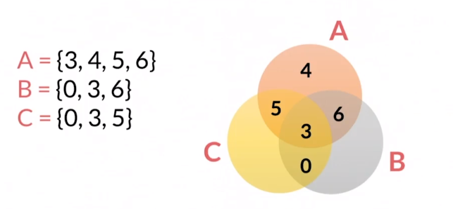
    <figcaption>Img 6 - Diagrama de Venn</figcaption>
</figure>

### Tipos de conjuntos

#### Universo (U ó Ω)

Formado por todos los elementos del tema de referencia

U={x/x es un animal}
A={x/x es un mamífero}
B={x/x es un reptil}

#### Vacío ({} ó ∅)

No tiene nungún elemento

A = Conjunto de lo meses del año que terminan en s.
B = Conjunto de números impares múltiplos de 2.
C = Conjunto de números que terminan en a.

#### Unitario

Tiene un sólo elemento

A = Conjunto de meses del año que tienen menos de 30 días.
B = Conjunto de números pares menores a 3.

#### Disjuntos

Aquellos que no tienen ningún elemento que pertenezca a ambos al mismo tiempo.

A = {x/x es un color}
B = {x/x es un órgano del cuerpo humano}

#### Iguales

Aquellos que tienen los mismos elementos

A = {a,b,c}
B = {c,b,a}
C = {b,c,a}

#### Infinitos

Aquellos cuya cantidad de elementos no se puede contar

A = Conjunto de números negativos

### Operaciones entre conjuntos

#### Unión

Es fusión de dos conjuntos

A = {1,2,3}
B = {2,3,4}

A **U** B = {1,2,3,4}

#### Intersección

Es el resultado de los elementos que comparten dos conjuntos

A = {1,2,3}
B = {2,3,4}

A **∩** B = {2,3}

#### Diferencia

Es el resultado de los elementos que no comparte un conjuntos con otro

A = {1,2,3}
B = {2,3,4}

A \ B = {1}

## Aritmética analógica

### Recta numérica

Es una recta en la que a cada uno de sus puntos le podemos asignar el valor de un número real.

<figure>
    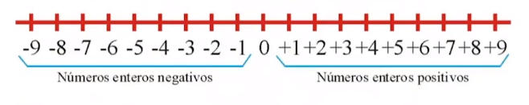
    <figcaption>Img 7 - Recta numérica</figcaption>
</figure>

### Ley de los signos

<figure>
    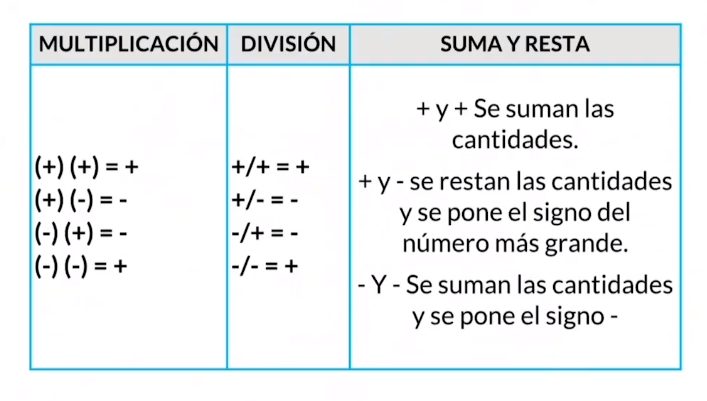
    <figcaption>Img 8 - Ley de los signos</figcaption>
</figure>

### Razones

#### Razón

Es una comparación entre dos o más cantidades, se puede expresar mediante una fracción.

- a : b
- a / b

Y se lee "a es a b". Las razones se pueden amplificar y/o simplificar, y se mantiene la razón

a -> antecedente
 
\-
 
b -> consecuente

#### Ejercicio

<figure>
    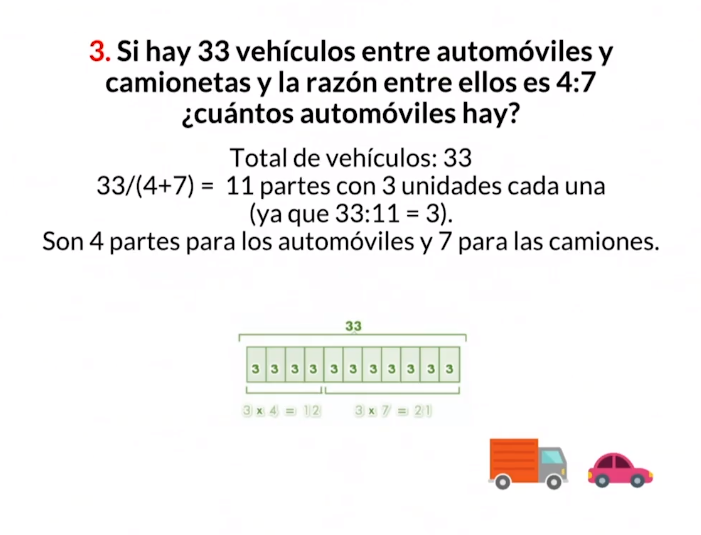
    <figcaption>Img 9 - Ejercicio Razones</figcaption>
</figure>

### Proporción

Es la igualdad entre dos razones.

<figure>
    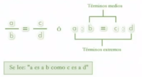
    <figcaption>Img 10 - Proporción</figcaption>
</figure>

El producto de los términos medios es igual al producto de los términos extremos.

<figure>
    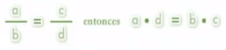
    <figcaption>Img 11 - Proporción 2</figcaption>
</figure>

#### Ejercicio

<figure>
    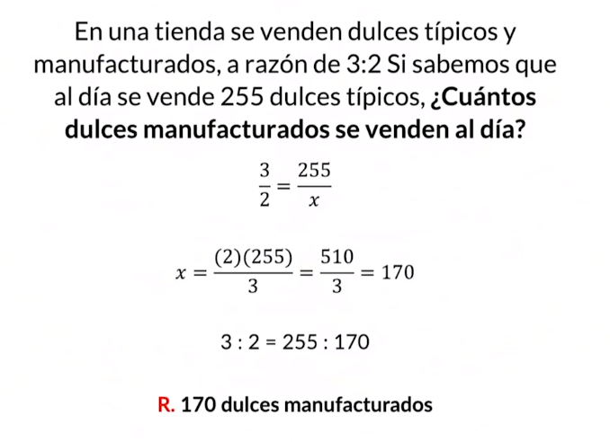
    <figcaption>Img 12 - Ejercicio Proporción</figcaption>
</figure>

### Teorema de Thales

>Si dos rectas, son cortadas por un sistema de rectas paralelas, entonces los segmentos que resultan sobre una de las dos rectas son proporcionales a los correspondientes obtenidos sobre la otra.

#### Ejercicios

<figure>
    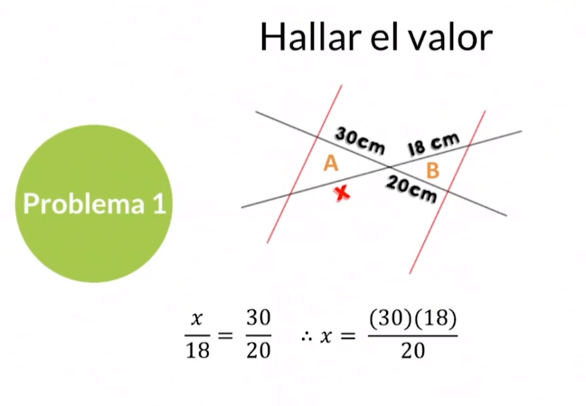
    <figcaption>Img 13 - Ejercicio Thales</figcaption>
</figure>

<figure>
    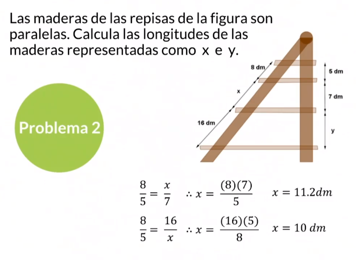
    <figcaption>Img 14 - Ejercicio Thales 2</figcaption>
</figure>

## Series y sucesiones

### Series numéricas

Sucesiones ordenadas de números que guardan un vínculo entre sí

- Finitas
- Infinitas
- Ascendetes
- Descendentes

a) 1,3,5,7 r=+2
 
b) 10,11,40,12,13,50 r=+1
 
c) 2000,1000,500,250 r=/1
 
d) 40,5,8,20,4 r=/el número anterior
 
e) 76543,2109,876 r=seguir la secuencia y restar 1 a la cifra

### Series alfabéticas

Sucesiones ordenadas de letras que guardan un vínculo entre sí

- Ascendentes
- Descendentes

a) a,m,b,c,m,d,e,f,m,g,h,i,j r=seguir el orden alfabético, aumentar una letra añadida y luego poner m
 
b) a,z,b,b,y,c,c,c,x,d,d,d r=en creciente ir de uno en uno y aumentar la cantidad que la letra aparece en 1, entre cada letra creciente poner una decreciente
 
c) G-F-H-L-K-M-P-O-Q r=-1+2+4
 
d) A-Z-C-V-F-S-J r1=+2+3+4 r2=-4-3-2

### Series alfanuméricas

Sucesiones ordenadas de letras y números que guardan un vínculo entre sí

- Ascendentes
- Descendentes

a) a,z,1,b,y,10,c,\_,100,d,w,\_,e R.x,1000
 
b) a,50,e,40,i,\_,\_ R.30,o
 
c) 9a,98z,987c,9876x,\_,987654v R.98765e
 
d) 1ab,\_,100ef,1000GH,10000ij,100000KL R.10CD
 
e) A,8,C,6,F,4,\_,\_ R.J,2

### Series de figuras

Sucesiones ordenadas de figuras que guardan un vínculo entre sí. Poseen uno o más patrones para establecer la siguiente figura.

<figure>
    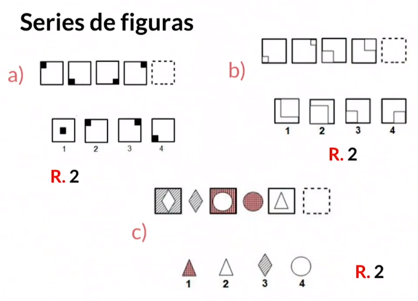
    <figcaption>Img 15 - Series de figuras</figcaption>
</figure>

<figure>
    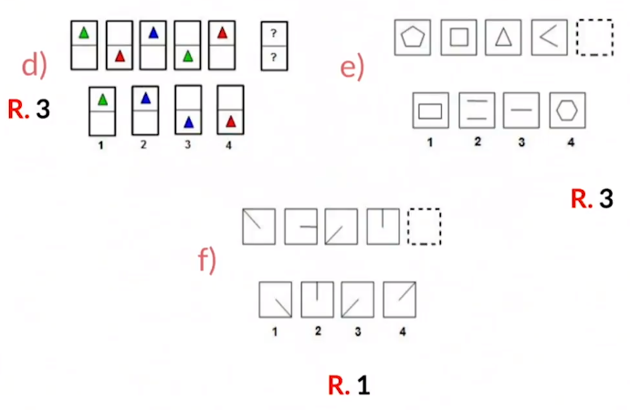
    <figcaption>Img 16 - Series de figuras 2</figcaption>
</figure>

## Diagramas de flujo

Representan gráficamente la secuencia de rutinas simples. Describe un proceso, sistema o algoritmo informático

### Toma de decisiones

Los diagramas de flujo ofrecen una descripción visual de las actividades implicadas en un proceso.

Muestra la relación secuencial entre ellas, facilitando la rápida comprensión de cada actividad y su relación con las demás, el flujo de la información y los materiales, las ramas en el proceso, la existencia de bucles repetitivos, el número de pasos del proceso, facilitan también la selección de decisión.

<figure>
    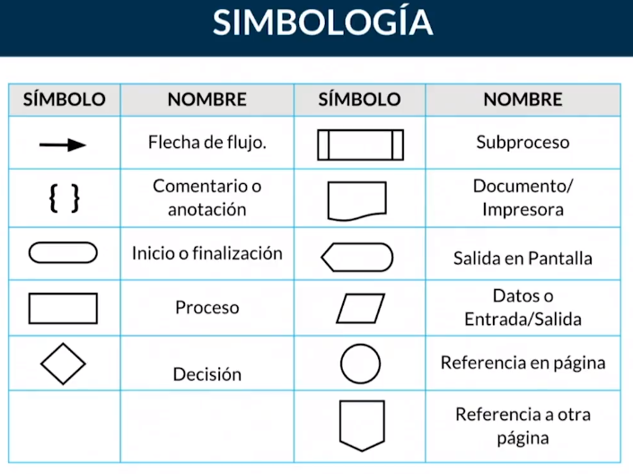
    <figcaption>Img 17 - Diagrama de flujo, simbología</figcaption>
</figure>

### ¿Cómo hacer un diagrama de flujo?

- Define tu propósito y alcance
- Identifica las tareas en orden cronológico
- Organizalos por tipo y figura
- Crea el diagrama de flujo
- Confirma el diagrama

<figure>
    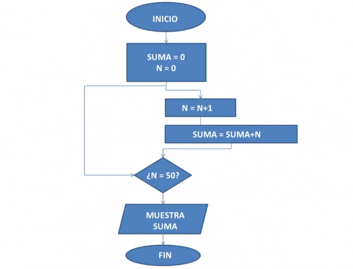
    <figcaption>Img 18 - Diagrama de flujo, ejemplo</figcaption>
</figure>

### Algoritmos en diagramas

#### Los diagramas de flujo pueden

- Explicar la lógica de un programa
- Organizar una perspectiva general antes de codificar
- Demostrar organización en el código
- Mostrar la estructura de un sitio web o aplicación
- Ser útiles para explicar a los demás nuestros proyectos

<figure>
    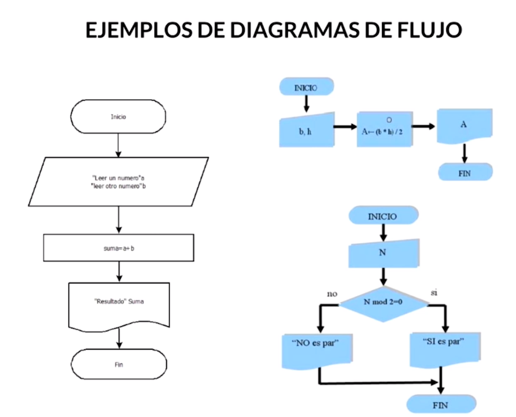
    <figcaption>Img 19 - Diagrama de flujo, ejemplo 2</figcaption>
</figure>

### Estructuras de control y palabras reservadas

Representan gráficamente la secuencia que siguen los diagramas de flujo

#### Estructura de control scuencial

Instrucciones consecutivas que se van ejecutando una después de la otra

<figure>
    
    <figcaption>Img 20 - Estructura de control secuencial</figcaption>
</figure>

#### Estructura de selección simple

Si se cumple alguna condición se realizan algunas acciones mientras que si no se cumple, no se realizan dichas acciones.

<figure>
    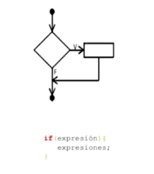
    <figcaption>Img 21 - Estructura de selección simple</figcaption>
</figure>

#### Estructura de control de selección doble

Si es V la condición, realiza un bloque de acciones; y si es F, hace otro.

<figure>
    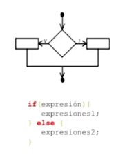
    <figcaption>Img 22 - Estructura de selección doble</figcaption>
</figure>

#### Estructura de control de repetición mientras

Es un ciclo que repite un bloque de instrucciones mientras la condición es verdadera.

<figure>
    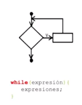
    <figcaption>Img 23 - Estructura de control de repetición mientras</figcaption>
</figure>

#### Estructura de control hacer / mientras

Es un ciclo que repite un bloque de instrucciones mientras la condición es verdadera.

<figure>
    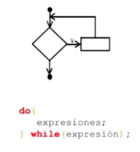
    <figcaption>Img 24 - Estructura de control hacer / mientras</figcaption>
</figure>

#### Estructura de control repetición para / hasta

Se utiliza para repetir un conjunto de acciones hasta que se deje de cumplir una condición

<figure>
    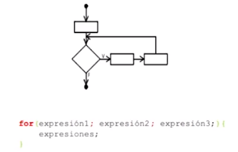
    <figcaption>Img 25 - Estructura de control repetición para / hasta</figcaption>
</figure>

# Glosario

## Términos

### Objeto de observación

Cuando se habla de un objeto no necesariamente es algo físico, se puede referir a una situación o un hecho, ya sea presente y pasado.

### Lógica

Es la disciplina que estudia los métodos y principios que se usan para distinguir el razonamiento bueno (correcto) del malo (incorrecto).

### Inferencia

Es el proceso de razonamiento, compuesto por proposiciones, por el cual se deriva o extrae una conclusión de una o varias premisas.
El término Inferencia es considerado como sinónimo de: “predicción”, “derivación” o “deducción”.

## Símbolos

- ∈: Pertenece
- ∉: No pertenece
- ⊆: Es un subconjunto
- ⊄: No es un subconjunto
- U ó Ω: Conjunto univero
- {} ó ∅: Conjunto vacío
- U: Unión
- ∩: Intersección
- \: Diferencia
- \>: Serie finita
- ∞: Serie infinita
- ↗: Serie ascendente
- ↘: Serie descendente