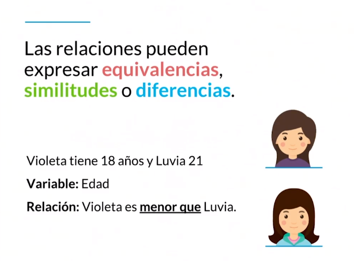
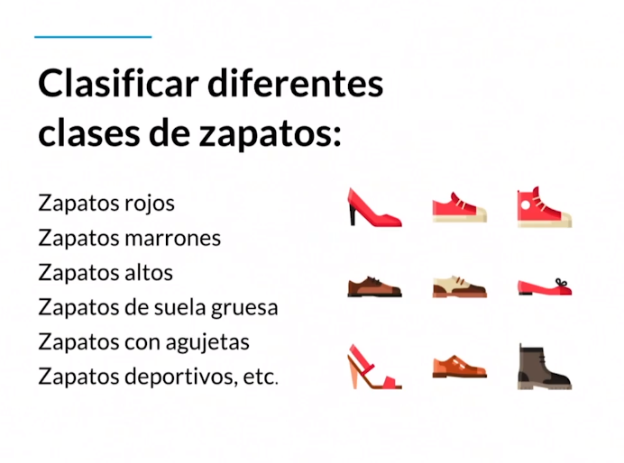
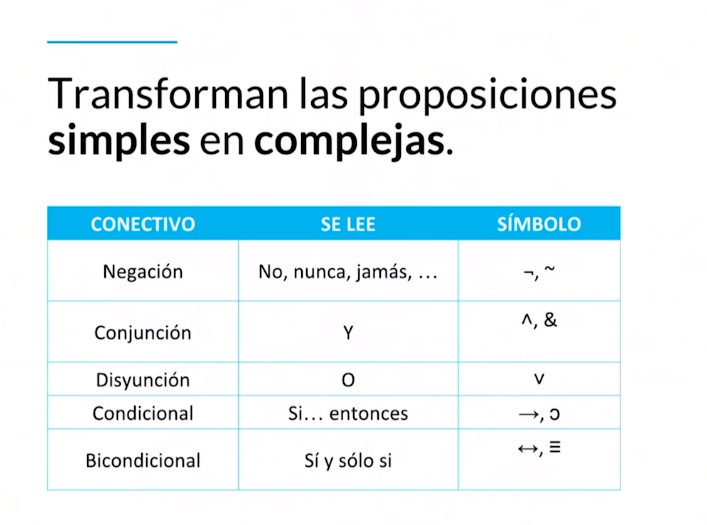

# Pensamiento Lógico

## Habilidades básicas del pensamiento

Procesos que permiten obtener información del [objeto de observación](#objeto-de-observación) y concluir al respecto.

### Principales habilidades del pensamiento

- Observación
- Descripción
- Comparación
- Relación
- Clasificación

### Observación

Dentro de la habilidad del pensamiento nuestra observación se conforma a partir de la percepción. Existen dos tipos de observaciones.

- Concreta: Es aquella que nosotros tomamos al instante, cuando estamos frente al objeto o hecho.
- Abstracta: Basada en experiencias previas, cuando recibimos información la relacionamos con puntos de vistas o lo que ya conocemos de ese objeto.

¿Cómo observamos?

- Percibimos
- Recopilamos
- Registramos
- Identificamos

Cuando nosotros observamos tomamos las variables de un objeto.

En la siguiente [imagen](#img1) tenemos diferentes tipos de cabello, las variables del cabello podrían ser el color, el largo, entre otros. Podrías utilizar tus sentidos para recopilar más información como el olor o la textura.

El tipo de observación viene dado por el tipo de suceso u objeto.

<figure>
    
    <figcaption>Img 1 - Cabello</figcaption>
</figure>

### Descripción

Se refiere a describir lo que ya observamos y se obtiene a partir de las siguientes preguntas:

- ¿Qué es?
- ¿Qué tiene?
- ¿Cómo es?
- ¿Qué función cumple?
- ¿Qué pasó?

¿Cómo describiríamos un pastel? ¿Cuáles son sus variables?

- Sabor
- Color
- Tamaño

Todas estas variables podemos responderlas o identificarlas a partir de las preguntas anteriores:

- ¿Qué es?: Un pastel
- ¿Qué tiene?: El cómo está conformado el pastel, glaseado, merengue, etc.
- ¿Cómo es?: Físicamente, ¿cómo lo percibimos? Rosa, azul, grande, pequeño, etc.
- ¿Qué función cumple?: Dar un momento placentero al gusto.
- ¿Qué pasó?:N/A

En base a las respuestas podemos entablar un enunciado para describir el pastel, ejemplo:

Es un pastel grande que sabe a vainilla, tiene una forma circular y es para mi cumpleaños.

Así es como nosotros captamos esta variables, les damos valores a partir del objeto que estamos estudiando y podemos hacer su descripción.

### Comparación

Observa la siguiente [imagen](#img2) durante unos segundos.

<figure>
    
    <figcaption>Img 2 - Astronautas</figcaption>
</figure>

La comparación se da a partir de la observación, ambas imágenes (derecha e izquierda) tienen ciertas diferencias:

- El cohete de la bandera tiene tonalidades diferentes.
- El punto en el logo de Platzi
- La nariz del chico

Cuando logras establecer **diferencies** y **semejanzas**, llegas a **particularizar** o **generalizar** y como consecuencia: **comparar**.

### Relación

Viene dada a partir de la comparación. Primero observamos, luego comparamos y luego unimos estos objetos con algún nexo (>, <, =, ≠).

Un ejemplo podría estar en la siguiente [imagen](#img3)

<figure>
    
    <figcaption>Img 3 - Relación</figcaption>
</figure>

Violeta tiene 18 y Luvia 21, nuestra variable es la edad. ¿Cómo podemos relacionar la edad entre estos dos objetos? La relación que nosotros podemos establecer está dada a partir del nexo que le podemos colocar a estos dos objetos, el nexo que podemos utilizar entre cantidades es precisamente >, <, = o ≠. Por ende el enunciado de nuestra relación es que Violeta es **menor que** Luvia, sin embargo podríamos tener otra relación que diga que Luvia es **mayor que** Violeta. O podríamos decir que Violeta tiene una edad **diferente a** la de Luvia.

### Clasificación

Es el proceso mental que permite agrupar objetos con base en sus semejanzas.

En la siguiente [imagen](#img4) se muestra como podemos agrupar un grupo de objetos no sólo entre una variable, sino entre varias variables.

<figure>
    
    <figcaption>Img 3 - Clasificación</figcaption>
</figure>

En la imagen vemos 9 zapatos y 6 variables, y estos 9 zapatos podrían ser clasificados en cada una de esas variables.

## Lógica Proposicional

Analiza las relaciones entre proposiciones, así como la verdad o falsedad de las mismas.

### Conceptos básicos

- Variables: son letras que utilizamos para denotar los enunciados o argumentos, por ejemplo: p, q, r, s, t.

- Conectores: Son símbolos que nos van a ayudar a conectar estas variables. También llamados conectivos lógicos.

- Auxiliares: Signos de agrupación que más que modificar nuestra lógica proposicional, nos sirven para agrupar y para darle un sentido de organización a lo que se está escribiendo.

- Enunciado: Es el conjunto de palabras con un sujeto y predicado.

- Proposición: Es un enunciado al que se le puede dar un valor, ya sea verdadero o falso.

- Premisa: Es aquella proposición que ya tenemos afirmado.

- Argumento: Es el conjunto de premisas.

- Conclusión: Viene a partir del conjunto de premisas.

### Inferencias lógicas

Son el proceso de razonamiento que se da a partir de una conclusión de una o varias premisas.

#### Clasificación

##### Según el número de premisas

- Inmediata
    - Premisa: Si Lucía siempre es puntual
    - Conclusión: Entonces, es falso que llegue tarde

- Mediata
    - Premisa 1: Todos los cuerpos se atraen
    - Premisa 2: La tierra y Venus son cuerpos
    - Conclusión: La tierra y Venus se atraen

##### Según la forma de razonamiento

- Deductiva
    - Premisa 1: Ningún mamífero nace del huevo
    - Premisa 2: Toda ave nace del huevo
    - Conclusión: Ningún ave es mamífero

-Inductiva
    - Premisa 1: El tucán tiene pico
    - Premisa 2: La guacamaya tiene pico
    - Premisa 3: La codorniz tiene pico
    - Conclusión: Toda ave tiene pico

### Conectivos lógicos

<figure>
    
    <figcaption>Img 5 - Conectivos Lógicos</figcaption>
</figure>

Ejemplo:

p = Estudio en Platzi
 
q = Apruebo el examen
 
 
¬q = No apruebo el examen
 
p^q = Estudio en Platzi y apruebo el examen
 
pvq = Apruebo el examen o estudio en Platzi
 
p->q = Si estudio en Platzi entonces apruebo el examen
 
q<->p = Apruebo el examen sí y sólo si estudio en Platzi

#### Doble negación

> La frase **no pasa nada** significa que pasa algo.

La doble negación establece que si un enunciado está **doblemente negado**, equivaldría al enunciado **afirmado**.

## Habilidades lógico matemáticas

### Puntos, triángulos, sudoku y acertijos

#### Tipos de pensamiento

- Numérico
- Espacial
- Medida
- Aleatorio
- Variaciones

# Glosario

### Objeto de observación

Cuando se habla de un objeto no necesariamente es algo físico, se puede referir a una situación o un hecho, ya sea presente y pasado.

### Lógica

Es la disciplina que estudia los métodos y principios que se usan para distinguir el razonamiento bueno (correcto) del malo (incorrecto).

### Inferencia

Es el proceso de razonamiento, compuesto por proposiciones, por el cual se deriva o extrae una conclusión de una o varias premisas.
El término Inferencia es considerado como sinónimo de: “predicción”, “derivación” o “deducción”.